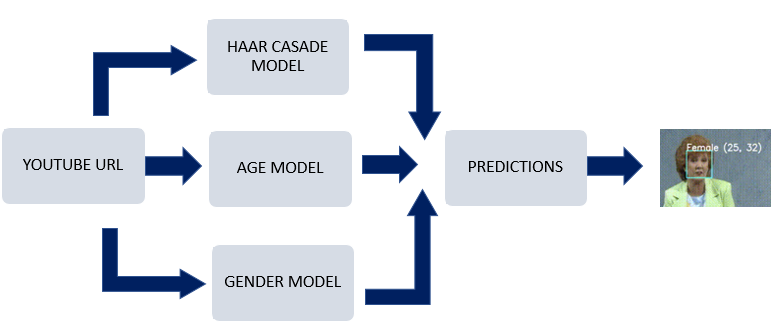
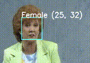

# Age and Gender Prediction

Using CNN (Convolutional Neural Networks) Face recognition, face detection are detected. By using Pre-trained models detect age and gender predictions from a YouTube video, 

## Problem Statement

YouTube URL as data, recognizing age, gender and face detection by pre trained models. 

## Architecture

## Steps Involved

* Get the video URL from YouTube.
* Face detection with Haar cascades
* Gender Recognition with CNN
* Age Recognition with CNN

### Pre_trained Models Used:

##### Age - deploy_age.prototxt
##### Gender - deploy_gender.prototxt
##### Face - haarcascade_frontalface_alt.xml

## Output 

