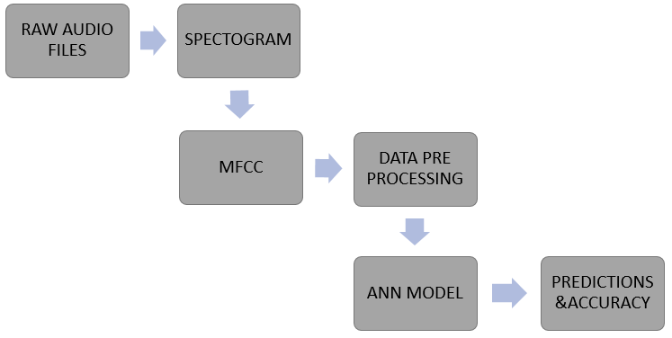
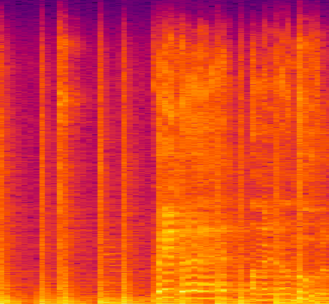

# Audio Data Analysis Using Deep Learning

Getting started with the audio data analysis and extract necessary features from a sound/audio file. Also build an Artificial Neural Network(ANN) for the music genre classification. 

## Problem Statement

With the audio data analysis extract features from a sound/audio file. Build an Artificial Neural Network(ANN) model for the music genre classification to accomplish the same by creating the Convolutional Neural Network and will compare their accuracy.

## Architecture

## Steps Involved

1. Extract and load your data 
2. Import all the required libraries.
3. Now convert the audio data files into PNG format images or basically extracting the Spectrogram for every Audio.
4. Creating a header for our CSV file.
5. Extracting features from Spectrogram: We will extract Mel-frequency cepstral coefficients (MFCC), Spectral Centroid, Zero Crossing Rate, Chroma Frequencies, and Spectral Roll-off.
6. Data preprocessing: It involves loading CSV data, label encoding, feature scaling and data split into training and test set.
7. Building an ANN model.
8. Fit the model

## Output 

##### Spectogram

## Blog
Please read this medium blog for more information - 
Part -I : https://levelup.gitconnected.com/audio-data-analysis-using-deep-learning-part-1-7f6e08803f60

Part -II :https://levelup.gitconnected.com/audio-data-analysis-using-deep-learning-with-python-part-2-4a1f40d3708d
