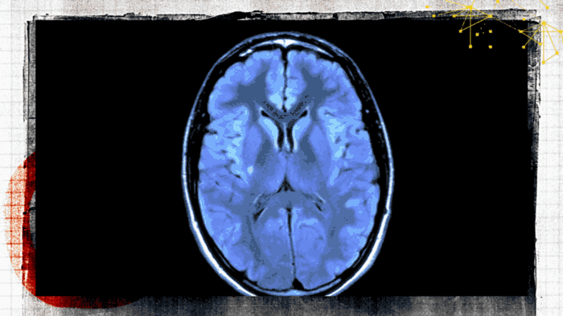
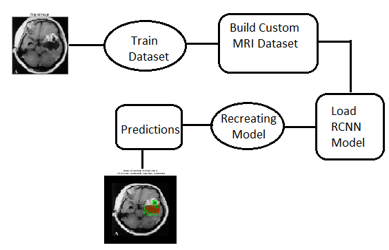

# Brain Tumor Detection Using Mask R-CNN

In the field of medicine, medical image analysis and processing play a vital role, especially in Non-invasive treatment and clinical study. Medical imaging techniques and analysis tools help medical practitioners and radiologists to correctly diagnose the disease. Medical Image Processing has emerged as one of the most important tools to identify and diagnose various anomalies. Imaging enables doctors to visualize and analyze the MR images for finding the abnormalities in internal structures. An important factor in the diagnosis includes the medical image data obtained from various biomedical devices which use different imaging techniques like X-rays, CT scans, MRI, mammogram, etc.

## Problem Statement

Build a Mask R-CNN model capable of detecting tumors from MRI scans of the brain images.

## Architecture

## Steps Involved

Step 1: Clone the Mask R-CNN repository and Brain MRI scan as input data.
load Mask R-CNN code implementation
!git clone https://github.com/matterport/Mask_RCNN.git 
load new data set and annotations
!git clone https://github.com/ruslan-kl/brain-tumor.git 

Step-2: Create the directory structure of your input image data.

Step-3: Configuration for training on the brain tumor dataset.

Step: 4: Build the custom brain MRI data set.

Step-5: Initialize the Mask R-CNN model for training using the Configuration instance that we created and load the pre-trained weights for the Mask R-CNN.

Step: 6: Load the dataset and train your model for 15 epochs with the Learning rate as 0.001.

Step 7: Recreate the model in inference mode.

Step 8: Now build functions to display the results.

## Output 

We are going to build a Mask R-CNN model capable of detecting tumours from MRI scans of the brain images.

## Blog
Please read this medium blog for more information - https://medium.com/@nageshsinghchauhan/brain-tumor-detection-using-mask-r-cnn-1ac586e1274
