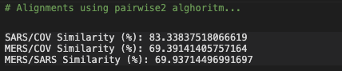
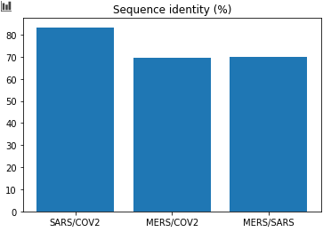

# COVID-19-coronavirus

The emerging global infectious COVID-19 coronavirus disease by novel Severe Acute Respiratory Syndrome Coronavirus 2 (SARS-CoV-2) presents critical fulminations to global public health and the economy since it was identified in late December 2019 in China.

Coronaviruses are a large family of viruses that can cause illnesses ranging widely in severity. The first known severe illness caused by a coronavirus appeared with the 2003 Severe Acute Respiratory Syndrome (SARS) epidemic in China. A second outbreak of severe illness originated in 2012 in Saudi Arabia with the Middle East Respiratory Syndrome (MERS). And now the ongoing outbreak of COVID-19.

## Problem Statement

By using COVID-19 DNA sequence data get insights regarding the proteins and  compare COVID-19 DNA with MERS and SARS understand the relationship among them.

## Output
Phylogenetic analysis of the complete viral genome (29,903 nucleotides) revealed that the COVID-19 virus was most closely related (83.3% nucleotide similarity) to a group of SARS-like coronaviruses (genus Betacoronavirus, subgenus Sarbecovirus) that had previously been found in bats in China.

#### Comparison Plot

## Blog

Please read this medium blog for more information - https://medium.com/@nageshsinghchauhan/coronavirus-covid-19-genome-analysis-using-biopython-8b8cb1f4a041
