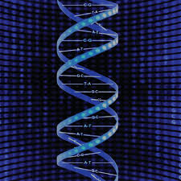
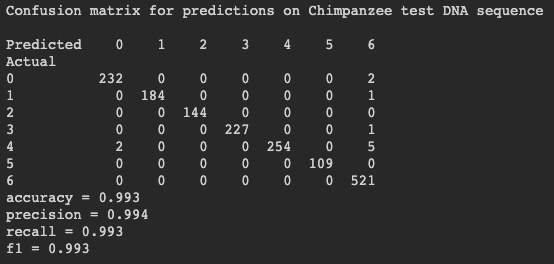

# DNA Sequence Using Machine learning

A genome is a complete collection of DNA in an organism. All living species possess a genome, but they differ considerably in size.
As a data-driven science, genomics extensively utilizes machine learning to capture dependencies in data and infer new biological hypotheses. Nonetheless, the ability to extract new insights from the exponentially increasing volume of genomics data requires more powerful machine learning models. By efficiently leveraging large data sets, deep learning has reconstructed fields such as computer vision and natural language processing. It has become the method of preference for many genomics modeling tasks, including predicting the influence of genetic variation on gene regulatory mechanisms such as DNA receptiveness and splicing.
So here, we will understand DNA structure and how machine learning can be used to work with DNA sequence data.

## Problem Statement

Interpret a DNA structure with machine learning algorithms used to build a prediction model on DNA sequence data.

## Architecture

## Output 

##### Human DNA Sequences

Let’s see how our model performs on the DNA sequences from other species. First, we’ll try the Chimpanzee, which we would expect to be very similar to humans. then the Dog DNA sequences.

##### Chimpanzee DNA Sequences

##### Dog DNA Sequences

The model seems to produce good results on human data. It also does on Chimpanzee which is because the Chimpanzee and humans share the same genetic hierarchy. The performance on the dog is not quite as good which is because the dog is more diverging from humans than the chimpanzee.
