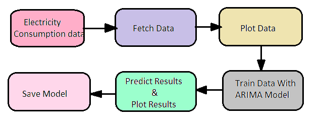
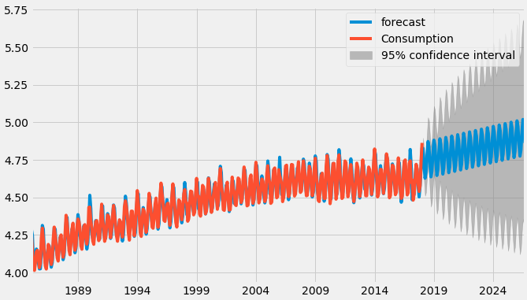

# Electricity Consumption Prediction Using Time Series Forecasting

Time series models are used to forecast future events based on previous events that have been observed at regular time intervals. 

## Problem Statement

Predicting electricity consumption using time series analysis by ARIMA model

## Architecture

## Steps Involved

* Visualizing time series
* Stationarising time series
* Finding the best parameters for our model
* Fitting ARIMA model 
* Predictions

## Output 

## Blog
Please read this medium blog for more information - 
https://towardsdatascience.com/predict-electricity-consumption-using-time-series-analysis-4650284e40aa
