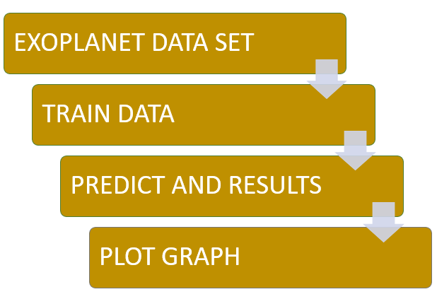
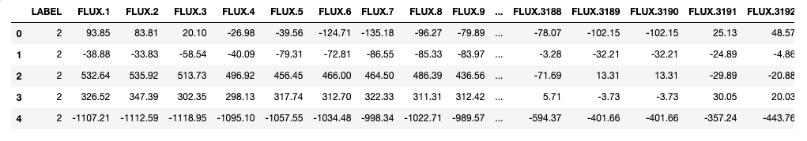
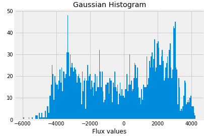
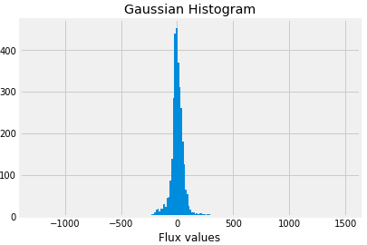
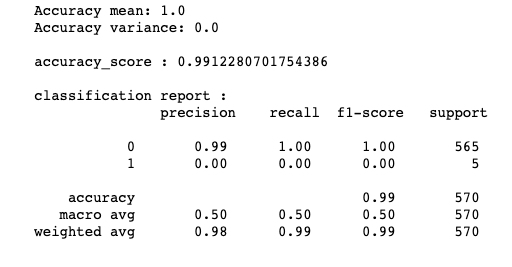
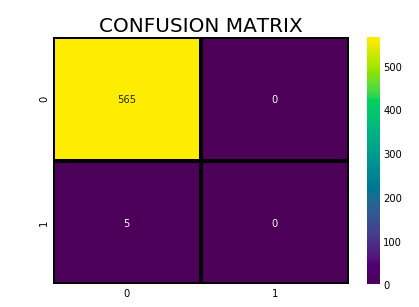

# Exoplanet Exploration Using Machine Learning

#### Exoplanets
Exoplanets are planets beyond our own solar system. Thousands have been discovered in the past two decades, mostly with NASA’s Kepler Space Telescope.
These exoplanets come in a huge variety of sizes and orbits. Some are gigantic planets hugging close to their parent stars; others are icy, some rocky. NASA and other agencies are looking for a special kind of planet: one that’s the same size as Earth, orbiting a sun-like star in the habitable zone.

## Problem Statement

With Exoplanet dataset make predictions about which planets might be hospitable to life.  Create a model that can predict the existence of an Exoplanet, utilizing the flux (light intensity) readings from 3198 different stars over time.

## Architecture

## Explanation

The dataset can be downloaded from : https://www.kaggle.com/keplersmachines/kepler-labelled-time-series-data
Load Data and Train.

#### Training Dataset

#### Presence of Exoplanets

#### Absence of Exoplanets

## Output

By using Svm classification model, the achieved accuracy - 

Plotting Correlation Graph

## Blog

Please read this medium blog for more information - https://towardsdatascience.com/exoplanet-hunting-using-machine-learning-d615958e1787
