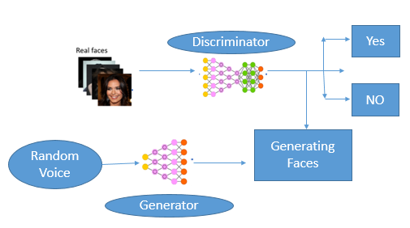

# Face-generation-GAN
The technology behind these kinds of AI is called a GAN, or “Generative Adversarial Network”. A GAN takes a different approach to learning than other types of neural networks. GANs algorithmic architectures that use two neural networks called a Generator and a Discriminator, which “compete” against one another to create the desired result. 

## Problem Statement

Our objective is to create a model capable of generating realistic human images that do not exist in reality.

## Architecture

## Explanation

#### Train Dataset

Dataset can be downloaded from: https://www.kaggle.com/jessicali9530/celeba-dataset

## Output:

.gif)
