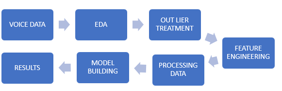
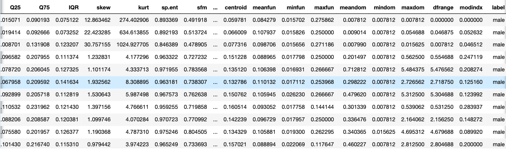
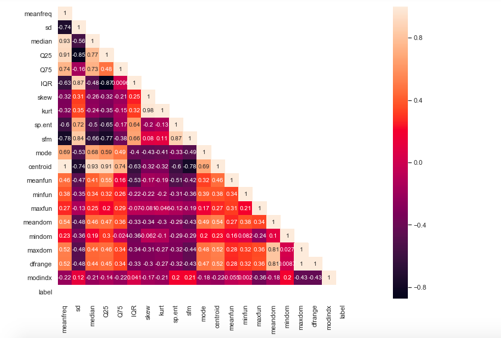
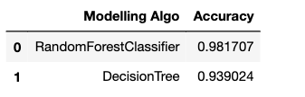
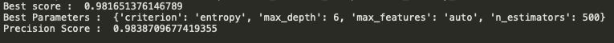
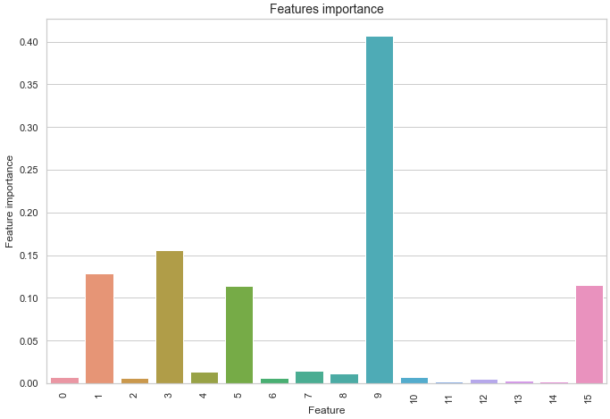

# Gender Prediction From Voice Data 

Build a Gender Recognition classifier using the Random Forest algorithm from the voice dataset. The idea is to identify a voice as male or female, based upon the acoustic properties of the voice and speech. The dataset consists of 3,168 recorded voice samples, collected from male and female speakers. The voice samples are pre-processed by acoustic analysis in R using the seewave and tuneR packages, with an analyzed frequency range of 0hz-280hz.

## Problem Statement

Build a Gender Recognition classifier using the Random Forest algorithm from the voice dataset.

## Architecture

## Steps Involved

* Load Dataset
* Data Pre-processing
* Feature Engineering
* Fitting Random Forest Classifier
* Fitting Decision Tree Classifier
* Plotting Comparisions
* Accuracies

## Explanation

The dataset can be downloaded from kaggle: https://www.kaggle.com/primaryobjects/voicegender
Load Data and Train.

#### Training Dataset

#### Heatmap

## Outputs

#### Random Forest Classifier and Decision Tree

#### Parameter Tuning with GridSearchCV

After hyperparameter optimization as we can see the results.

## Blog

For everything you need to know follow this medium article:
https://towardsdatascience.com/random-forest-a-powerful-ensemble-learning-algorithm-2bf132ba639d
