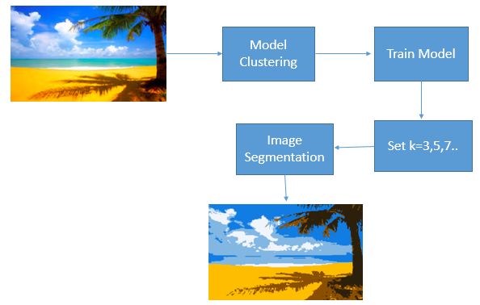

# Image Segmentation-K-means Clustering

Image segmentation is an important step in image processing, and it seems everywhere if we want to analyze what’s inside the image. For example, if we seek to find if there is a chair or person inside an indoor image, we may need image segmentation to separate objects and analyze each object individually to check what it is. Image segmentation usually serves as the pre-processing before pattern recognition, feature extraction, and compression of the image.

Image segmentation is the process of partitioning a digital image into multiple distinct regions containing each pixel(sets of pixels, also known as superpixels) with similar attributes.

## Problem Statement

Image Segmentation by using K-Means Clustering

## Architecture

## Output 

#### Visualize the output result with K=5

#### Visualize the output result with K=6

#### Visualize the output result with Canny Edge detection

## Blog
Please read this medium blog for more information - https://towardsdatascience.com/introduction-to-image-segmentation-with-k-means-clustering-83fd0a9e2fc3
