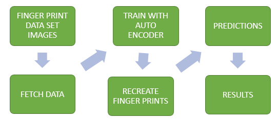
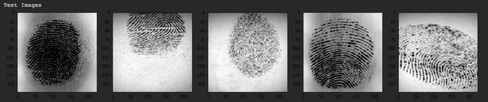
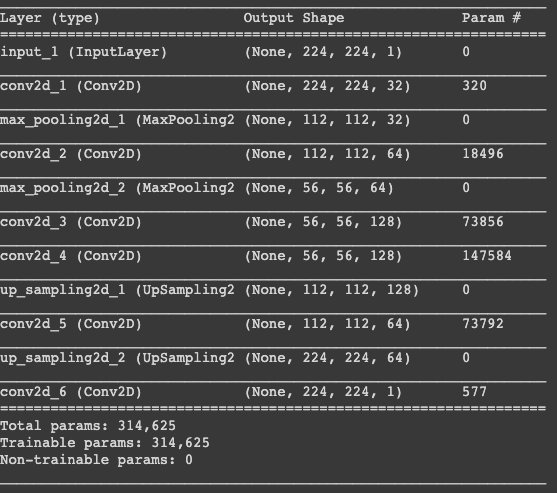
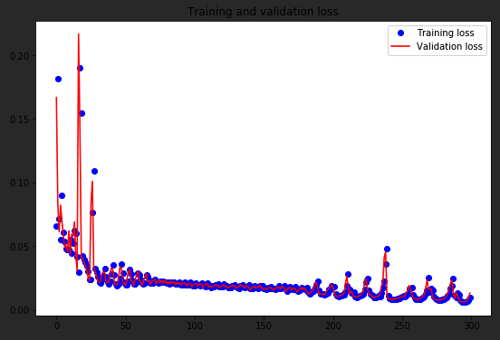
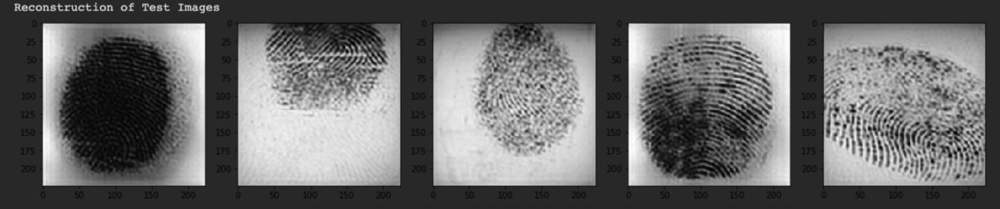

# Recreating Fingerprints Using Convolutional Autoencoders

Build a Neural network that is capable of recreating or reconstructing fingerprint images.

## Problem Statement

Collecting fingerprints dataset by using Autoencoders recreating fingerprints

## Architecture

## Explanation

The dataset that I’m using is the FVC2002 fingerprint dataset. It consists of 4 different sensor fingerprints namely Low-cost Optical Sensor, Low-cost Capacitive Sensor, Optical Sensor and Synthetic Generator, each sensor having varying image sizes. The dataset has 320 images, 80 images per sensor.

Download dataset: http://bias.csr.unibo.it/fvc2002/databases.asp

#### Training Dataset

#### Tranning Model

## Output
Finally, you can see that the validation loss and the training loss both are in sync. It shows that your model is not overfitting: the validation loss is decreasing and not increasing, plotted graph on 'Training Loss' and 'Validation Loss'

##### Plot

##### Recreated Fingerprints

## Blog

Please read this medium blog for more information - https://towardsdatascience.com/recreating-fingerprints-using-convolutional-autoencoders-5c576e479d4f
