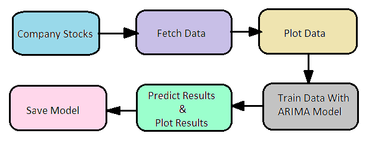
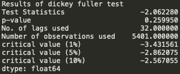

# Stock-market-forecasting

The general research associated with the stock or share market is highly focusing on neither buy nor sell but it fails to address the dimensionality and expectancy of a new investor. The common trend towards the stock market among the society is that it is highly risky for investment or not suitable for trade so most of the people are not even interested. The seasonal variance and steady flow of any index will help both existing and naïve investors to understand and make a decision to invest in the stock/share market.
To solve these types of problems, the time series analysis will be the best tool for forecasting the trend or even future. The trend chart will provide adequate guidance for the investor.

## Problem Statement

Used ARIMA model with optimal parameters that will forecast the closing price of the stocks on the test data.

## Architecture

## Steps Involved

* Visualizing time series
* Stationarising time series
* Finding the best parameters for our model
* Fitting ARIMA model 
* Predictions

#### Training Dataset

## Output 

#### Results of Dickey-fuller test

#### ARIMA Model Results

Around 3.5% MAPE(Mean Absolute Percentage Error) implies the model is about 96.5% accurate in predicting the test set observations. Now you know how to build an ARIMA model for stock price forecasting.

##### MSE: 0.03330921053066402

##### MAE: 0.13801238336759786

##### RMSE: 0.18250811086267923

##### MAPE: 0.035328833278944705

## Blog

Please check this Blog to know everything about it.
https://towardsdatascience.com/stock-market-forecasting-using-time-series-c3d21f2dd37f
