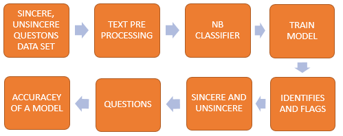
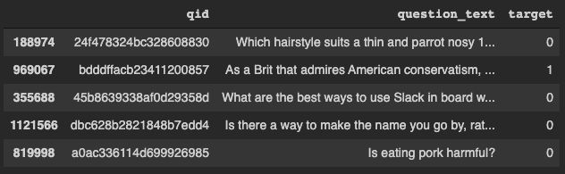
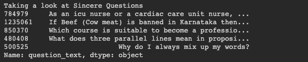
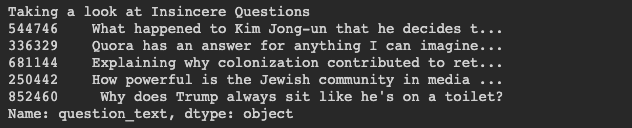

# Quora Questions Text Classification 

Text Classification is done by using NLP. The simplest solutions are usually the most powerful ones, and Naïve Bayes is a good example of that. Despite the great advances of the Machine Learning in the last years, it has proven to not only be simple but also fast, accurate, and reliable. It has been successfully used for many purposes, but it works particularly well with natural language processing (NLP) problems.

## Problem Statement

Naïve Bayes classification model that identifies and flags Quora insincere questions.

## Architecture

## Explanation

The dataset can be downloaded from here : https://www.kaggle.com/c/quora-insincere-questions-classification/data
Load Data and Train.

#### Training Dataset

#### Sincere Questions

#### Insincere Questions

## Output

By using Naïve Bayes classification model, the achieved accuracy is 94.13991769547326

## Blog

Please read this medium blog for more information - https://medium.com/swlh/na%C3%AFve-bayes-algorithm-everything-you-need-to-know-9bf3104b78e5

